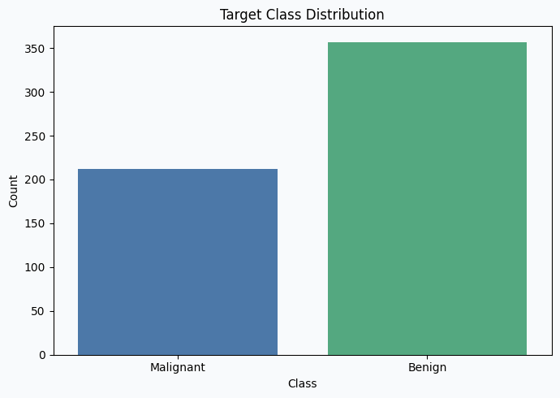
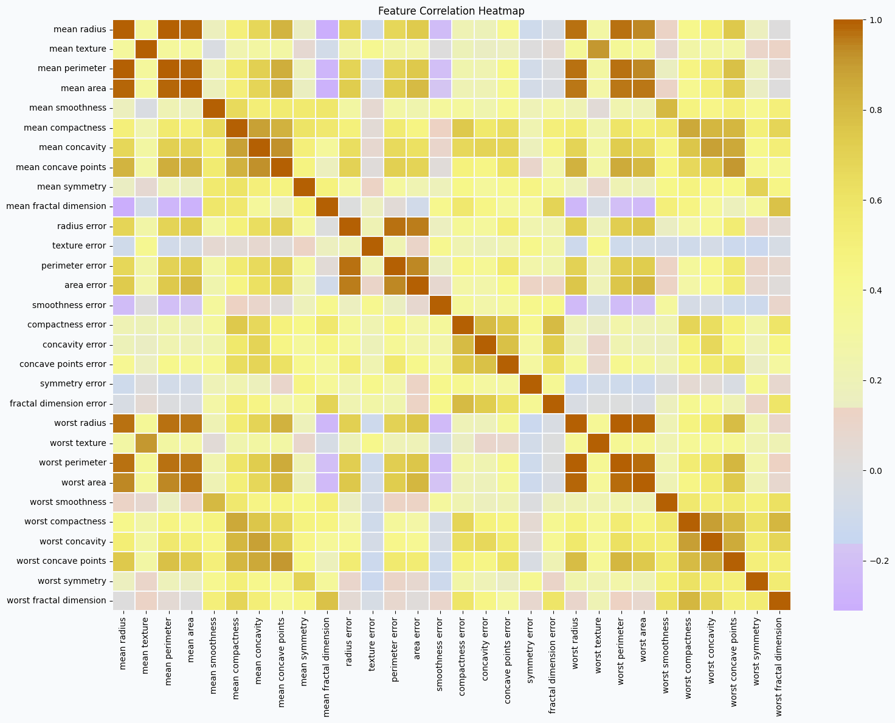
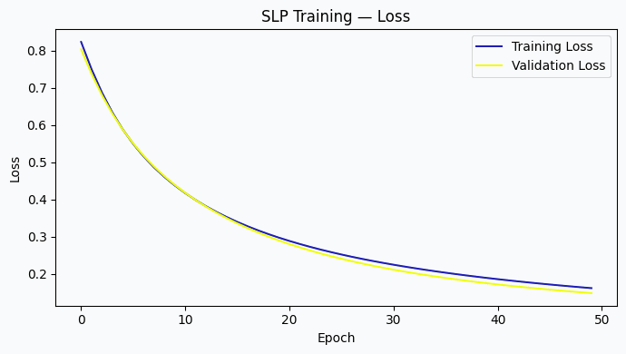
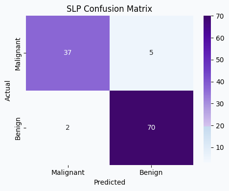
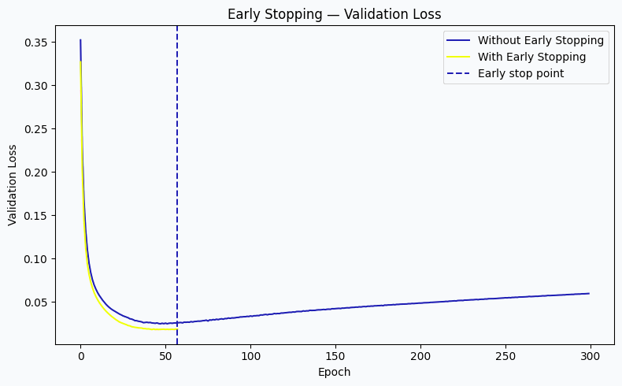
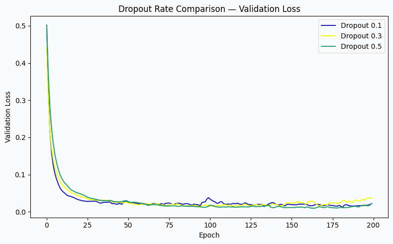
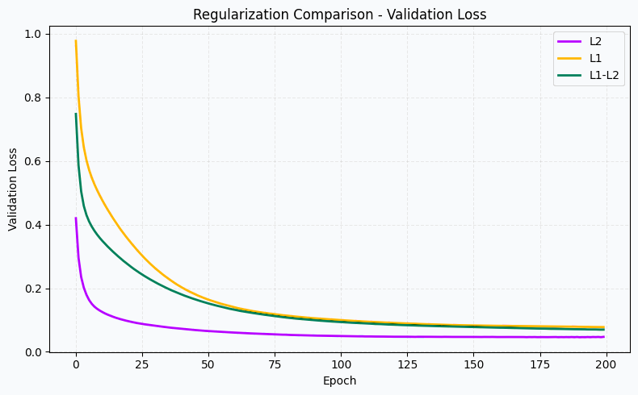

# Deep Learning PR1 — Breast Cancer Wisconsin (Diagnostic) | Refreshed Edition

A hands-on deep learning project built with **TensorFlow/Keras** that walks through the core building blocks of neural network training — from a single-layer perceptron to regularized multi-layer networks — using the Breast Cancer Wisconsin (Diagnostic) dataset.

> **Presentation update:** The project concept, dataset, experiments, model settings, and reported results are kept the same. The notebook visualizations and plot styling have been refreshed to give the project a distinct visual appearance.

**Topics covered:** SLP · MLP · Data Scaling · Activation Functions · Early Stopping · Dropout · L1 / L2 / L1-L2 Regularization



---

## 📊 Dataset

The dataset is loaded directly from `sklearn.datasets.load_breast_cancer()`:

- **569 samples**, 30 numeric features, 1 binary target
- Target encoding: `0 = Malignant`, `1 = Benign`
- Class counts: 212 Malignant / 357 Benign (moderately imbalanced)
- No missing values, no duplicate rows

Features are standardized with `StandardScaler` before training, since neural network optimizers are sensitive to differing feature scales.




---

## 🎥 Project Explanation Video

A complete video explanation of this Deep Learning PR1 project is provided below.

The video demonstrates the project step-by-step, including:

- 📊 Dataset loading and Exploratory Data Analysis (EDA)
- 🔍 Class distribution and correlation heatmap
- ⚙️ Data preprocessing using StandardScaler
- 🧠 Single-Layer Perceptron (SLP)
- 🤖 Multi-Layer Perceptron (MLP)
- 🔄 Comparison of ReLU, Tanh, and Sigmoid activation functions
- ⏹️ Early Stopping and comparison with a model without Early Stopping
- 🎲 Dropout comparison using 0.1, 0.3, and 0.5
- 🛡️ L1, L2, and L1-L2 regularization
- 📈 Model evaluation and comparison
- 🏆 Best model selection
- 💡 Final project conclusion and clinical/business insights

### ▶️ Video Demonstration

> **Project Explanation Video:**  
> [Click here to watch the complete project explanation](https://drive.google.com/file/d/1CEf29vgH_gbi0LZvJX1p91E5axzd2nqD/view?usp=sharing)

The video provides a practical walkthrough of the notebook, code implementation, results, and the key concepts used in this project.

---
---

## 🧠 Project Structure / Tasks

| Task | Description |
|------|-------------|
| 1 | Dataset loading, EDA, class distribution, correlation heatmap, train/test split, `StandardScaler` |
| 2 | Single-Layer Perceptron (SLP) baseline |
| 3 | Multi-Layer Perceptron (MLP) with ReLU, Tanh, and Sigmoid activation comparison |
| 4 | Early Stopping experiment vs. a model trained for the full epoch budget |
| 5 | Dropout experiment at rates 0.1, 0.3, and 0.5 |
| 6 | L2, L1, and L1-L2 regularization comparison |
| 7 | Final comparison table and best-model discussion |

---

## 🚀 Results Snapshot

### Single-Layer Perceptron (baseline)
- **Test Accuracy:** 0.9386
- **Test Loss:** 0.1855

| Class | Precision | Recall | F1-score |
|---|---|---|---|
| Malignant | 0.95 | 0.88 | 0.91 |
| Benign | 0.93 | 0.97 | 0.95 |




### Activation Function Comparison (MLP)
Best performing activation on test F1: **Tanh**

| Metric | Score |
|---|---|
| Accuracy | 0.9649 |
| Precision | 0.9722 |
| Recall | 0.9722 |
| F1 | 0.9722 |

### Early Stopping
Training stopped automatically at **epoch 58** (best weights restored from epoch 43), avoiding unnecessary training and overfitting.

| Model | Accuracy | Precision | Recall | F1 |
|---|---|---|---|---|
| With Early Stopping | 0.9474 | 0.9853 | 0.9306 | 0.9571 |
| Without Early Stopping | 0.9561 | 0.9855 | 0.9444 | 0.9645 |



### Dropout Comparison


### Regularization Comparison (L1 / L2 / L1-L2)


---

## 🛠️ Setup

1. Clone or download this repository.
2. Create a virtual environment (recommended):
   ```bash
   python -m venv venv
   source venv/bin/activate   # on Windows: venv\Scripts\activate
   ```
3. Install dependencies:
   ```bash
   pip install -r requirements.txt
   ```
4. Launch the notebook:
   ```bash
   jupyter notebook DL_PR1.ipynb
   ```

### Requirements

```
tensorflow>=2.15
scikit-learn>=1.3
pandas>=2.0
numpy>=1.24
matplotlib>=3.7
seaborn>=0.12
jupyter>=1.0
ipykernel>=6.0
```

---

## 📓 Google Colab Notebook

The complete project is available in Google Colab. You can open and run the notebook directly using the link below.

### 🔗 Open in Google Colab

[🚀 Open DL PR1 Notebook in Google Colab](https://colab.research.google.com/drive/1ptPt06_m7G8jI9azWWO1PcIGJLQZlvvr)

The Colab notebook contains the complete implementation, including:

- Dataset loading and EDA
- Data preprocessing and StandardScaler
- Single-Layer Perceptron (SLP)
- Multi-Layer Perceptron (MLP)
- Activation function comparison
- Early Stopping
- Dropout
- L1, L2 and L1-L2 regularization
- Model evaluation and comparison
- Final conclusions

---

## 📁 Repository Structure

```
.
├── DL_PR1.ipynb        # Main notebook — all tasks, code, and markdown explanations
├── requirements.txt    # Python dependencies
├── images/              # Refreshed result plots referenced in this README
└── README.md            # This file
```

---

## 📌 Key Takeaways

- Feature scaling is essential for stable gradient-based optimization.
- Adding hidden layers with nonlinear activations lets the network learn nonlinear decision boundaries that an SLP cannot.
- Early Stopping and Dropout both act as regularizers that curb overfitting, trading a small amount of raw fit for better generalization.
- L1, L2, and combined L1-L2 penalties each shape the learned weights differently — L1 encourages sparsity, L2 encourages smaller/smoother weights.
